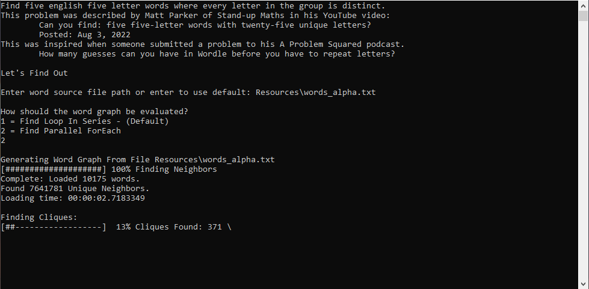
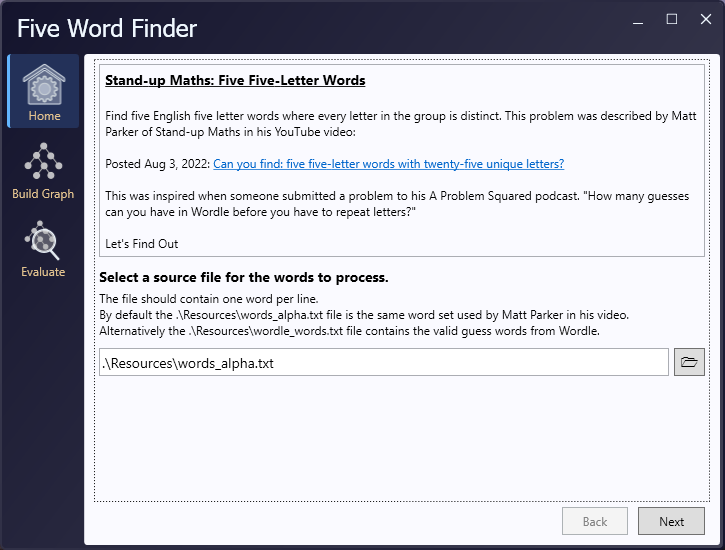
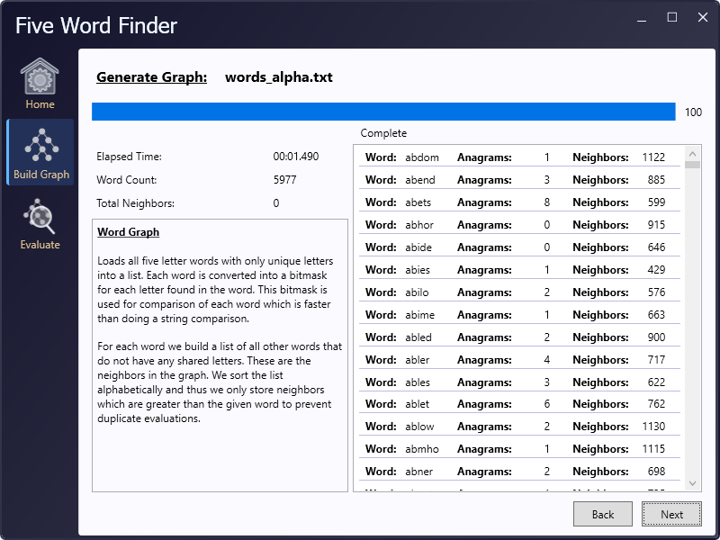
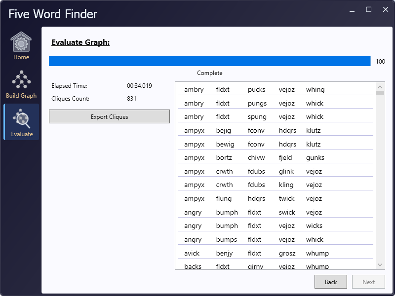

# FiveWordFinder
Copyright (C) 2022 - Chris Oldenhouse

## Stand-up Maths: Five Five-Letter Words
Find five English five letter words where every letter in the group is distinct.

This problem was described by Matt Parker of Stand-up Maths in his YouTube video:

[Can you find: five five-letter words with twenty-five unique letters?](https://www.youtube.com/watch?v=_-AfhLQfb6w)

Posted: Aug 3, 2022

This was inspired when someone submitted a problem to his A Problem Squared podcast.

"How many guesses can you have in Wordle before you have to repeat letters?"

## Description
In the above video Matt described the problem of searching for as many word guesses as possible before repeating any letters in the game Wordle. He expanded the problem to just be finding five five letter English words that as a group do not share any letters. Matt created a python algorithm that executed on his laptop took more than a month to complete.

Matt then noted he was provided an optimized algorithm written by [Benjamin Paassen](https://gitlab.com/bpaassen/five_clique) who sought to solve this problem using graph theory. Benjamin described approaching the problem instead as:
>Consider all 5-letter words (without repeated letters) of the English language as nodes in a graph, and we say that two words are neighbors if they share no letters. Finding 5 words with distinct letters now is equivalent to finding a [5-clique](https://en.wikipedia.org/wiki/Clique_(graph_theory)) in this graph, meaning a cluster of 5 words where each word is neighbor to each other word in the cluster.

Benjamin's approach was able to solve this problem in 21 minutes ad 46 seconds. A significant improvement over the month taken by Parker's original algorithm.

## A .Net Approach
I was curious about implementing a take on the faster graph theory in C# to see how quickly I could get the analysis completed with my own implementation and have a go at further optimizations. I also wanted an excuse to spend more time with WPF UI development as in my day job I spend most of my time with WinForms. As such there is extra work in places that isn't normally needed.

To accomplish this task the process performs the following:
1. Reads the given text file of words
   - Test word length reject any words that are not 5 characters long

2. Evaluate word
   - Each word structure contains a bitmask to store the active letters in the word. This becomes important for using bitmasks and bitwise comparison operations much faster than string comparisons.
     - Convert letters to lower case
     - convert each letter to an index 0-25 (a-z)
     - Use bitwise shift to set the indexed bit
       ```
       A 32 bit int maps the bits as follows:
             zyxwvutsrqponmlkjihgfedcba
       00000011111111111111111111111111
   - Creates an unsigned integer SortHash built from the index values of each letter 1-26 (a-z) creating a 10 digit int for sort operations. Again faster than direct string comparisons. If this were to ever be made to work with words greater than 5 letters an alternative would be needed or move to using a 64 bit integer to give more digits. The explanation of the SortHash calculation from the code is:
     ```
     Store 5 character words as an unsigned integer value.
     Each letter has an index between 1-26 which is then stored across a 10 digit number. 2 digits for each position.
     This function converts each letter into it's numeric alphabet index and then multiplies each value by a power
     of 10 to place it into the position in the unsigned int.
                                     t  h  r  e  e
     (Example: 'three' is encoded as 20|08|18|05|05)
     uint value                      2008180505
   - If the word has fewer unique character bits set than the length we can reject this word as it has duplicate letters.

3. Next we create the graph by comparing each word's bitmask with any words alphabetically greater than it. If they share no set bits then add them to the first word's neighbors. This is done to prevent having to prevent wasted itterations on duplicate word groups just in different orders.

4. Evaluate the graph to find the groups of 5 words which do not share any letters. To accomplish this I used a recursive function with a maximum depth of 5. Each pass of the recursion works on the intersection of the prior words and their neighbors. If it reaches 5 calls on the stack then we have found a clique of words.

My implementation completed the process in:
- **5.539 seconds** processing Parker's English words file of 370105 words finding the 10175 unique 5 letter words and generating their neighbors
- **1 minutes 53.795 seconds** To Evaluate the graph and find all the groups of 5 words that do not share letters.

## Usage Guide
Download the source code and build the solution, or you can download the release which contains all the files necessary to run.
I have included Matt Parker's original 'words_alpha.txt' file which can also be obtained [On hit github](https://github.com/dwyl/english-words)
I have also included a file 'wordle_words.txt' which contains all the valid word guesses for the Wordle game.
Both files are included in the Resources folder.

There are two programs contained. A Console Application and a WPF UI Application.
Chose the one you wish to run. They should complete in a similar amount of time.

### Console
Run the **FiveWordFinderConsole.exe**
Follow the on screen prompts:
1. Enter the path for the word file to use.
   - <Enter> to use the default .\Resources\words_alpha.txt file
2. Select the evaluation strategy.
   - 1 Runs the process in a single work loop. (This is the slowest method.)
   - 2 runs the process in parallel (This is the one I used for the above times)
3. Once the process is complete it will write the found cliques to the screen and to a tab delimited file 'found_cliques.txt' in the application folder.

  
### Windows WPF UI
Run the **FiveWordFinderWpf.exe**
1. Select the word file to use. It will default to .\Resources\words_alpha.txt.


2. Select Build Graph from the Menu on the left, or click Next in the lower right. If a valid file has been selected it will begin processing the word file automatically to prepare the graph for evaluation.

  
3. Select Evaluate from the Menu, or click Next. Once the words file has been loaded this screen will begin evaluating the graph to find all groups of 5 words and display matches as they are found.


Once finished you can use the Export Cliques button to save the found groups to a specified tab delimited file.
